# 📚 My Bookshelf

**My Bookshelf** is a beautifully designed Android app built with Kotlin and Jetpack Compose that lets users create, customize, and organize their personal book collections. Designed for readers and collectors who want a simple, elegant way to manage their library.

> 📚 Organize your collection.
> 🔍 Discover new books.
> 📤 Share your shelves with friends.

---

## ✨ Features

- 🧱 **Drag-and-Drop Shelf Builder** – Add and arrange books on custom shelves
- 🔍 **Search & Add Books** – Use Open Library API for easy book lookup
- 🔗 **Bookshelf Sharing** – Export and share your shelves via deep links
- 🎨 **Custom Shelf Styles** – Choose from different materials and colors
- 📱 **Offline-First** – All your data stored locally on your device

---

## 🔒 Privacy & Data

**MyBookshelf is a privacy-first, local-only application:**
- ✅ All data stored locally on your device
- ✅ No user accounts or authentication required
- ✅ No analytics, tracking, or telemetry
- ✅ No data collection or transmission to external servers
- ✅ Internet connection only used for book search via Open Library API
- ✅ Open source and transparent - review the code yourself

**Your library data never leaves your device.**

---

## 🧱 Tech Stack

- **Language**: Kotlin
- **UI**: Jetpack Compose
- **Architecture**: MVVM + Clean Architecture
- **Database**: Room (local SQLite database)
- **APIs**: Open Library API for book search and metadata  
- **Image Loading**: Coil3 with Ktor3 network integration
- **Dependency Injection**: Koin
- **Navigation**: Jetpack Navigation Compose
- **Export/Import**: Local deep link sharing system

---

## 🛠 Setup (Coming Soon)

Instructions for setting up the project locally will be added here.

---

## 🚀 Planned Features

- Personal ratings and reading status tracking
- Search and filter books within shelves
- Manga & comic support via AniList/ComicVine APIs
- Affiliate link integration (Amazon Associates, Bookshop.org)
- Reading habit reminders and progress tracking
- Advanced shelf themes and customization
- Enhanced search filters and book recommendations

---

## 📸 Preview

### Welcome & Tutorial

  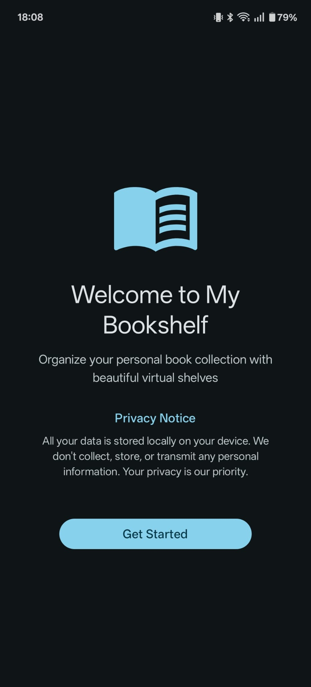
  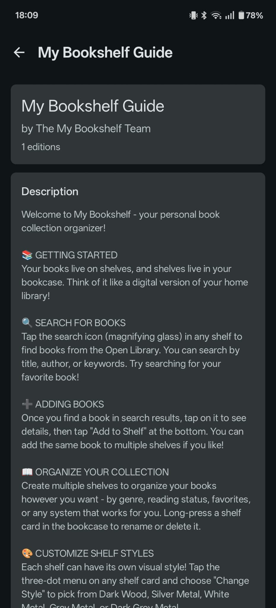

### Bookcase Management

  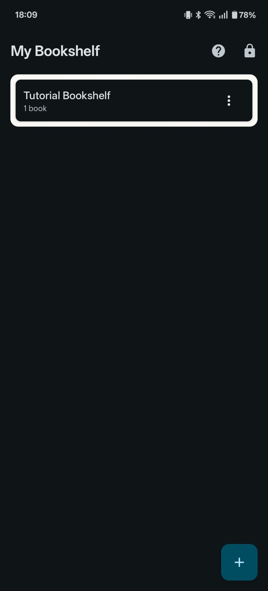
  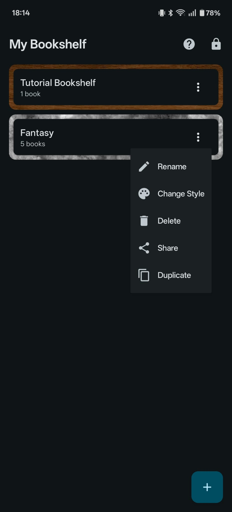
  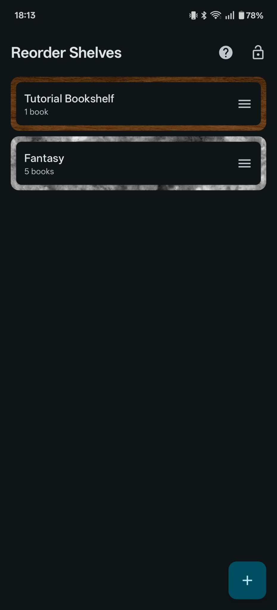

### Shelf Customization

  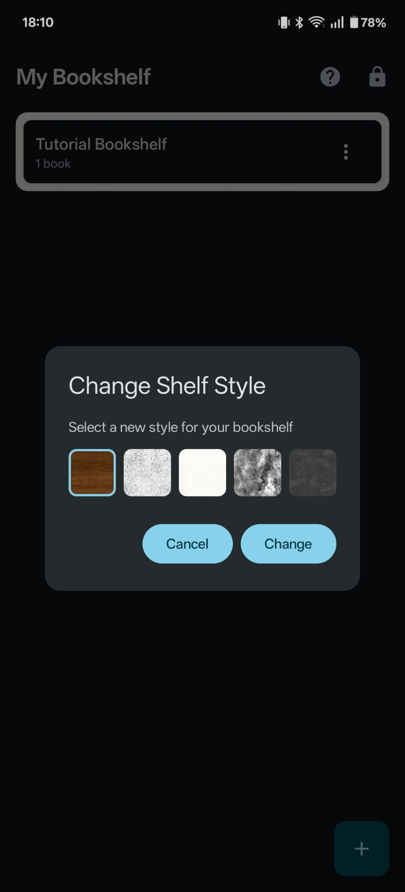
  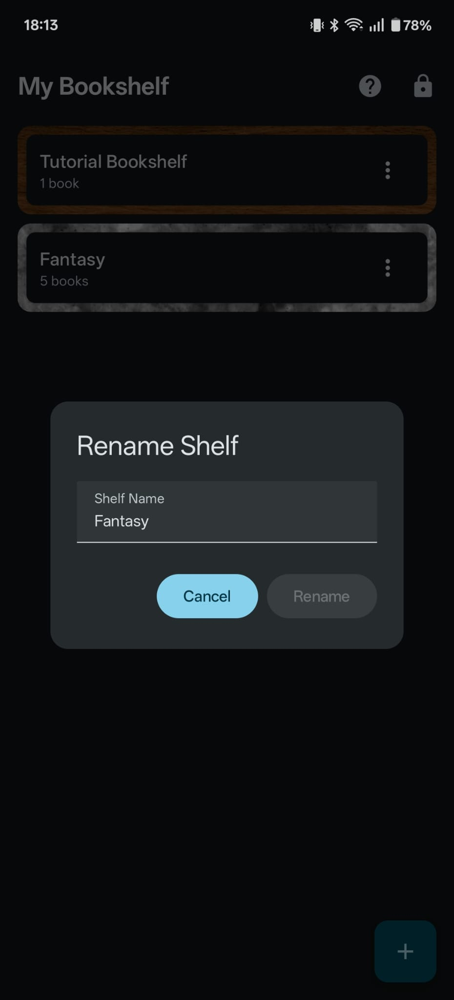
  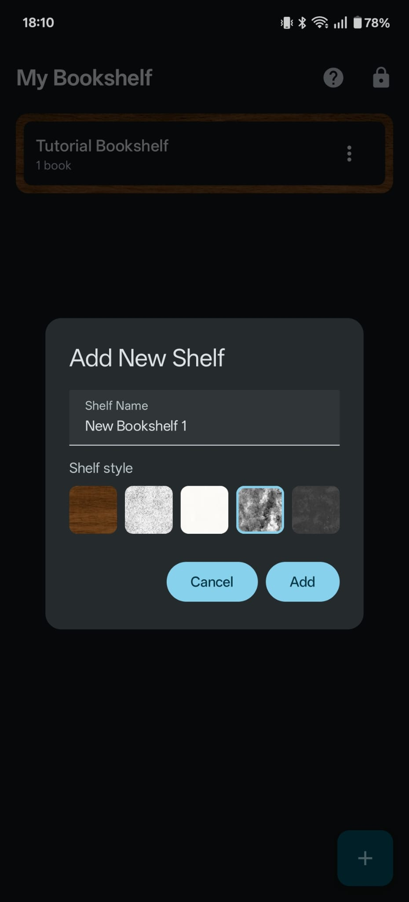

### Book Organization

  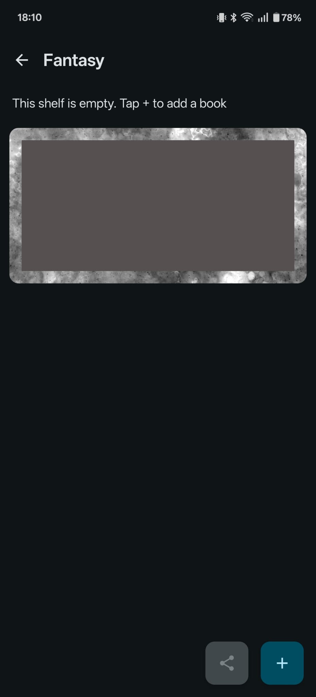
  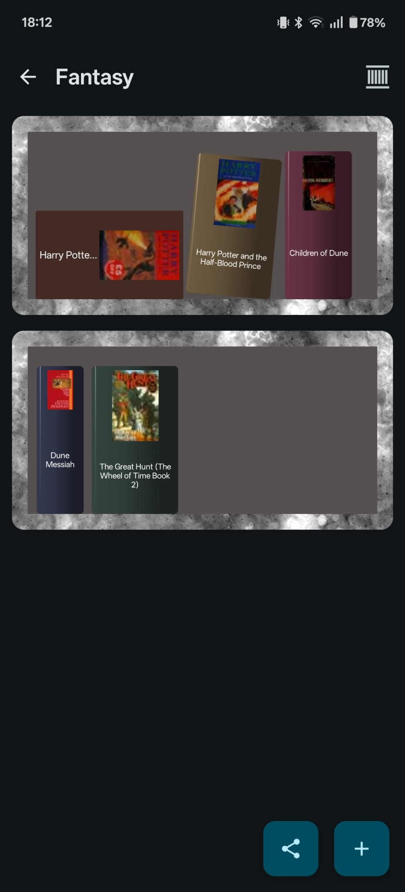
  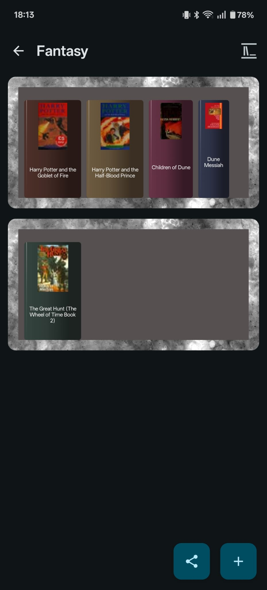

  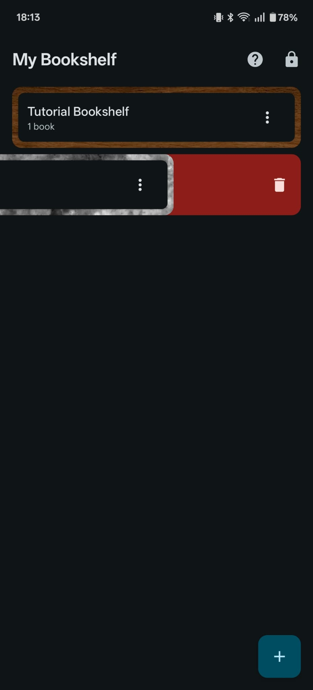

### Book Search & Details

  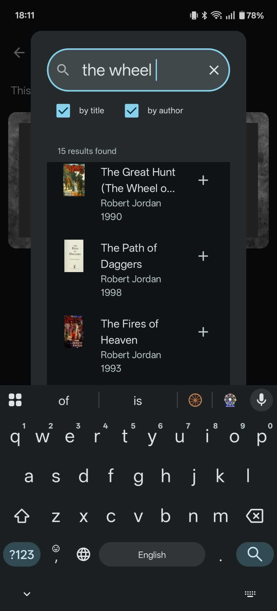
  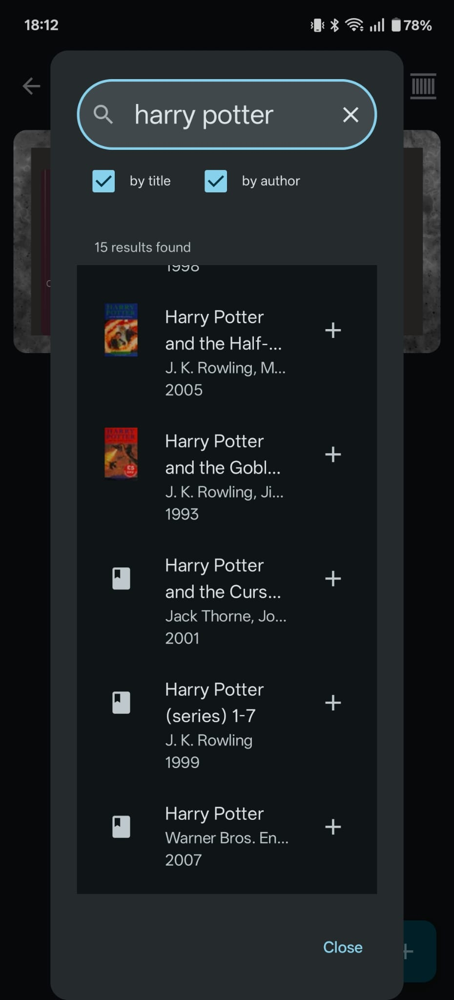

  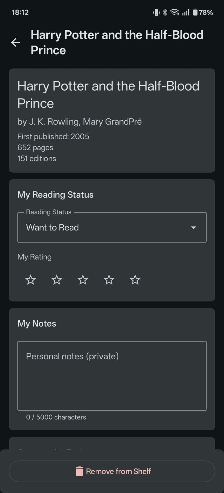
  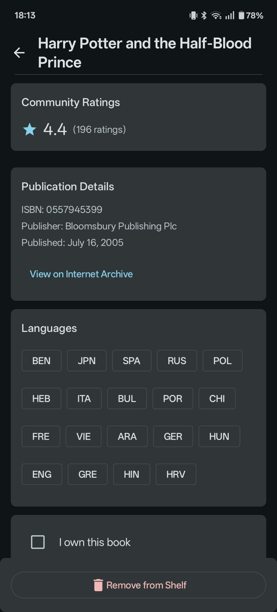

### Sharing

  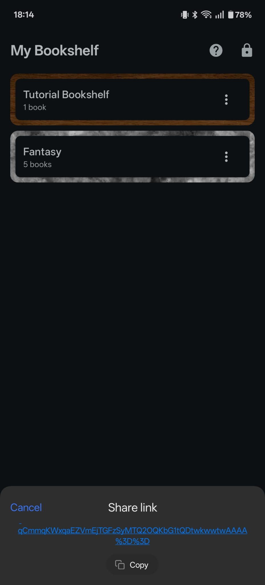

---

## 📜 License

This project is licensed under the MIT License - see the [LICENSE](LICENSE) file for details.

Copyright © 2025 Joseph Brightman ([@zlurgg](https://github.com/zlurgg))

---

## 📧 Contact

Built by Joseph Brightman ([@zlurgg](https://github.com/zlurgg))
